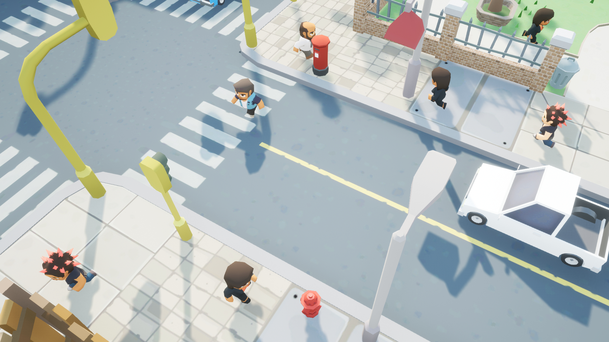
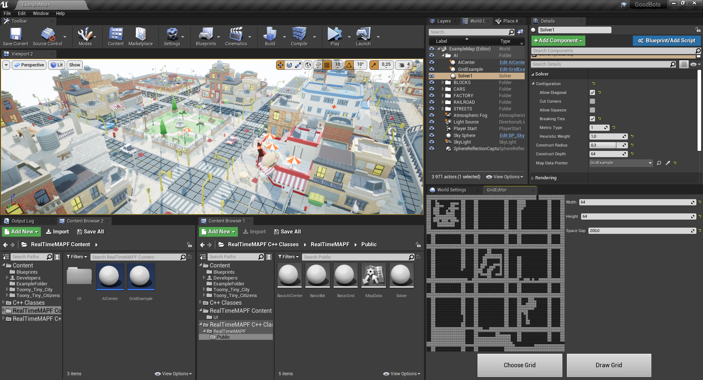

# RealTimeMAPF
Unreal Engine 4 plugin for real-time multiagent pathfinding

This plugin comes with different classes to help your AI to asynchronously find collision-free paths. You can look at the use scenario below clicking 

    

### Quick Start

### Screenshots

