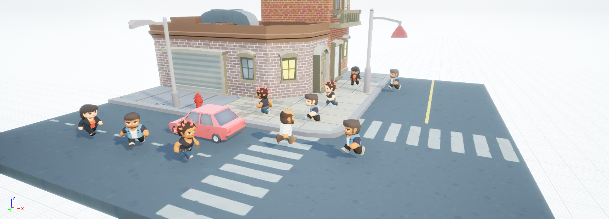
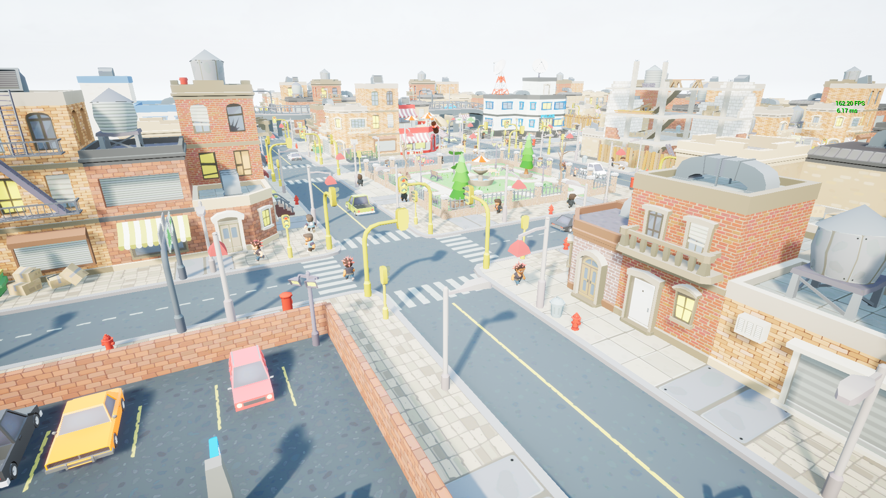

# RealTimeMAPF

Unreal Engine 4 plugin for real-time multiagent pathfinding.

Includes tools and classes to help your Artificial Intelligence system to **asynchronously** and **cooperatively** find collision-free paths.

Here you can find a screenshot and a video that demonstrate some of the plugins' features:

    

## Overview

This plugin is the second part of a large project on Multi-Agent Pathfinding. To see more details about used algorithms, in-depth details and data formats you can visit the [testing platform](https://github.com/MShepelin/MultiAgentPathFinding) GitHub repository, which is the first part of the project. Main algorithms and planning techniques used in this plugin were described in

> Silver, David. "Cooperative Pathfinding." *Aiide* 1 (2005): 117-122

To add this plugin to a project, you can clone this repository in the project's *Plugins* folder. Unreal will automatically offer to build the plugin, but you can also use a *Compile* button inside the Editor. Let's examine the plugin's classes (both in C++ and Blueprints sections) and their Details:

* **GridExample** inherits a **BasicGrid** which implements **MapData** interface. This interface is used by a planner to get information about the environment, which is a 2D grid. Grid cells can be traversable and non-traversable, which defines obstacles that agents can't go through.

  * *Width*, *Height*,  and *Space Gap* describe the size of the map on a level. *Time Gap* is used by *Visual Logger* to show debug information. More details about it down below.

* In the *UI* folder you can find **Grid Editor**, which helps you to work with **BasicGrid**. You can run this widget inside the editor using the *Run Editor Utility Widget* button. To tune a grid you should put it inside a level, select it and click *Choose Grid* button. The grid changes when you push buttons, which is shown with a green cube. You can also use *Draw Grid* to compare the physical objects on a level and the created grid.

  

- **Solver** is a core component of plugin which is responsible for planning and storing paths.
  - *Configuration* lets you set up agents possible moves. You can allow them to use diagonals, cut corners or even squeeze between obstacles. Other options are for advanced users of pathfinding algorithms (to know more checkout out [the other part](https://github.com/MShepelin/MultiAgentPathFinding) of this project).
  - *Construction Radius* sets the size of all agents as a fraction of cell size. It influences the set of moves, available for agents.
  - **Solver** considers the time as discrete value and plans paths inside a 3D time-space grid so that all agents know about actions of others. Because we want our agents to start moving as fast as possible we limit their cooperation depth. *Construct depth* sets this limit and it can be changed to balance between agents intelligence and performance. More details about the planning process can be found down below.

* **AICenter** and **BasicBot** are used as an example of how to actually use this system. They are written in C++ but you can recreate the same logic with Blueprints. The functionality of the **Solver** class lets you implement different ways of organizing interleaving planning and agents movement, but by default we recommend to use section-based windowed approach described in the original paper that we base our development on (Silver, 2015). Now we are going to describe this approach and its motivation.

## Pathfinding principles

Each agent plans its path using a *reservation table* where other agents write information about their movement. Each plan is limited by *cooperation depth*, which is the limit of time where agents find the best path. So the length of each plan is equal to this *cooperation depth*. As the result each move "takes into account" the next moves of other agents, which means that the first steps are more likely to be correct in terms of overall planning process. In other words, the more time an agent uses its plan, the more likely it is following a nonoptimal path. To avoid illogical behavior we recommend to use no more than a half of each plan. So how do we actually replan?

To improve real-time performance each time the *Plan* function is called **Solver** chooses a section of agents and plans their paths leaving plans of other agents as they are. When **MoveTime** function is called the plan of every agent goes several time units forward. The time is still considered as discrete. The default approach is to move time by 1 unit and maintain this equation:
$$
{Number \ of \ agents\over Section \ size}\le {Cooperation \ depth\over 2}
$$
Maintaining this equation guarantees that even if the section is not updated during the *Plan* execution this section's agents still have more than a half of depth planned steps.

Overall this approach is used like this:

* When an agent is added to the system, plan its limited path (handled by **Solver**)
* Get agents next moves using *GetNextMove*
* Call *MoveTime* and *Plan* so that while agents actually move on a level Solver can asynchronously prepare the needed plans.

Looks confusing? The best way to know explicit details is to read *BasicAICenter.h*, keeping an eye on *BeginPlan* execution process.

**Warning: this plugin don't use complete or optimal solvers, planning process can fail and must be handled according to your AI system implementation**

## Visual Logger

To actually see agents plans we added support of Visual Logger. If you enable it in *Window $\rightarrow$ Developer Tools $\rightarrow$ Visual Logger*, you can capture and analyze the processes inside a *reservation table* where the system stores found paths. To change the height of the cells implement *GetTimeGap* of your *MapData* implementer or change the *TimeGap* variable in a *BasicGrid* object.

## Example project

Using this plugin and some assets we created an example project. Windows build can be found [here](https://disk.yandex.ru/d/WO2kFN8b3KKOVA). This little game allows you to fly in a little town using W, A, S, D to move, E, Q to go up and down and a Mouse to look around. While you fly the system plans and you can see how it uses multithreading to avoid affecting FPS. Here are some screenshots from an editor and the game:

## What's next?

This is just a beginning! The project forms a basis for multiagent solver inside Unreal Engine, but it can be improved to fit high industrial standards. These are some features that can be added in future:

* Support of dynamic environment modifications
* Agents with different sizes and speeds
* Prioritization and ordering techniques
* Traversability settings
* Out-of-the-box targeting system
* Integration with NavMesh
* Advanced hierarchical search
* Multithreaded reservation table 
* Advanced editor UI and algorithm options